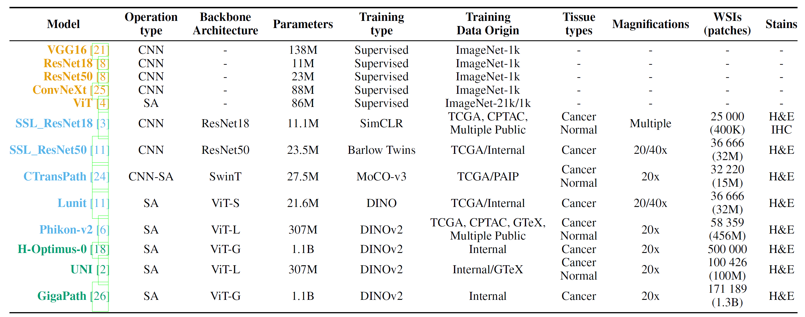
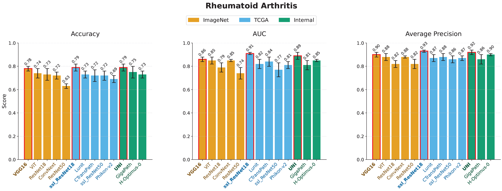
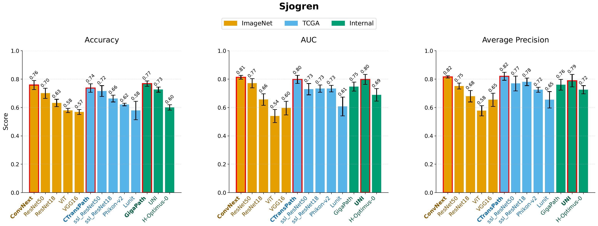
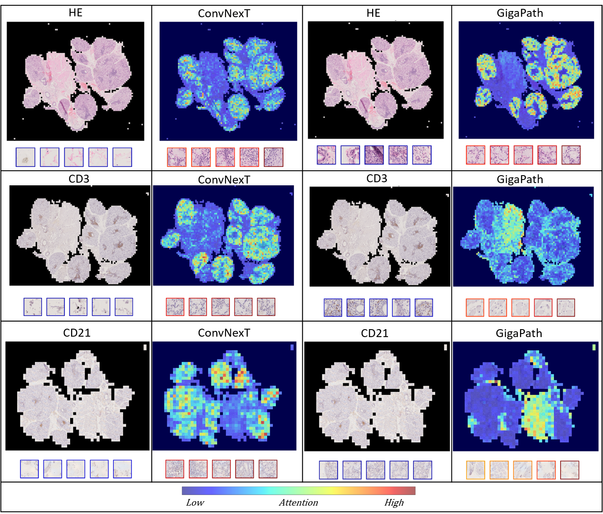

[](https://arxiv.org/abs/2410.21560)

# ImmunoHisto Benchmark

We assess performance of histopathology foundation models trained on H&E cancer 
dataset on OOD Immunohistochemistry (IHC) autoimmune datasets. 

## Models benchmarked



## Results

<p align="center">


</p>

<p align="center">

</p>

## How to run the code (WIP)

### Basic Usage

1. Set up your configuration file (e.g., RA_config.yaml)
2. Run the complete pipeline:

```bash
python main.py --config RA_config.yaml --preprocess --train --test --visualise
```
